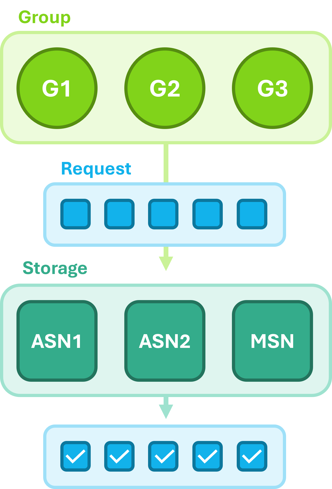

# Online Movie Streaming

repository for the optimization and simulation project (2025) on *Online Movie Streaming* for *MATH-600*.

## Installation

To install the project and setup the environment via conda run the following commands
```bash
conda create --name opt-sim-online-movie-streaming python=3.13.2
pip install -r requirements.txt
```

## Structure

<p align="center">
  
</p>

### Simulation

The population of users is modelled by multiple *Group* which generate batches of movie *Request* according to their internal
preference. Those requests are fed to the closest *Storage* unit which contain the requested movie. The units process each request on a first-come-first
served basis. The main output of the simulation is an array of requests with their respective **wait times** (time between 
birth and processing + serving).

### Optimization

The optimization consists in finding the optimal assignment of movies to storage units according to various statistics such as
the **average** and **maximal wait time**. At each iteration, the optimization generate a new assignment of movies from the
current best solution using random regenerations, replacements, and swaps. If the **statistic** of the new assignment is better than
the current best solution, it is kept as the new best solution.

A single simulation is run followed by a **bootstrap** to estimate the number of simulations necessary to obtain an accurate estimate
of the **statistic** with a 95% confidence interval within a specified tolerance. The tolerance is a fixed parameter kept constant or
linearly decreased over the iterations from *1s* to the fixed parameter.

the **statistic** is then computed over the number of simulations specified above, either as a *Monte-Carlo* or a *Control-Variate* estimate
using the maximal request rate per storage unit and time interval as the variate.

An optional constraint skips the simulation and reject the new assignment if any request rate to unit over any time interval is greater than the processing rate.
If this is the case, the storage units accumulate requests in a queue, greatly increasing wait times.

### Files

- *group.py* : *Group* module generating *Request*
- *request.py* : *Request* module containing the movie requested, group of origin, birth time, assigned storage unit and wait times.
- *storage.py* : *Storage* module processing batches of *Request* and computing the wait times.
- *simulation.py* : *Simulation* module for running the simulation which returns the array of processed *Request*.
- *stats.py* : *Statistics* module for computing various statistics of the simulation output.
- *optimization.py* : *Optimization* module for finding the optimal assignment of movies to storage units.
- *main.py* : Main script for running the simulation and optimization and creating various plots.
- *utils.py* : Helper functions for the simulation and optimization.
- *constants.py* : Fixed constants used in the simulation.
- *plot_candidate_best.py* : Script for plotting the candidate and best solutions during optimization.
- *optimization_analyse* : Helper script to analyze the choice of assignment generation functions during optimization which resulted in better assignment.

## Quickstart

### Optimization & Simulation

To obtain the optimal assignment and create the plots:

```python
from main import main
main()
```

If the optimal assignment is known, it can be passed to the function to avoid running the optimization:
```python
from main import main
best_hashset = {'ASN1': {8, 2, 6, 7}, 'ASN2': {8, 9, 5, 7}, 'MSN': {0, 1, 2, 3, 4, 5, 6, 7, 8, 9}}
main(best_hashset)
```

### Simulate Model

The model can be simulated using:
```python
from simulation import Simulation
sim = Simulation()
requests = sim.run()
```

### Optimize Assignment

The optimization can be interacted with using:
```python
import numpy as np
from optimization import Optimization

# generation/optimization functions to be used
optimization_fct_names = [
    "random",
    "replace_one", 
    "replace_two",
    "swap_one", 
    "swap_two",
    "swap_three",
    "replace_one_fill", 
    "replace_two_fill",
    "replace_three_fill",
]

optimization = Optimization(
    print_results=True,
    random_seed=0,
)

best_hashset, waiting_time_best = optimization(
    optimization_fct_names=optimization_fct_names, 
    num_optimization_iters=100,                     # number of optimization iterations
    num_iters_per_optimization=250,                 # maximal number of simulations per optimization iteration
    metric_fct=np.mean,                             # statistic of wait times optimized
    tolerance=0.01,                                 # tolerance for the statistic 95% CI
    use_control_variate=True,                       # use control variate for the statistic estimate
    use_mean_rate_constraint=True,                  # skip iteration if any request rate greater than processing rate
    save_optimization_fct_history=False,            # save the history of optimization functions used
    choose_optimization_fct_randomly=False,         # choose optimization function randomly at each iteration
    decreasing_tolerance=True                       # decrease the tolerance linearly from 1s to the specified tolerance
)
```

